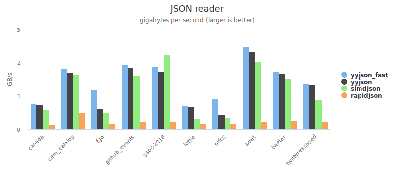
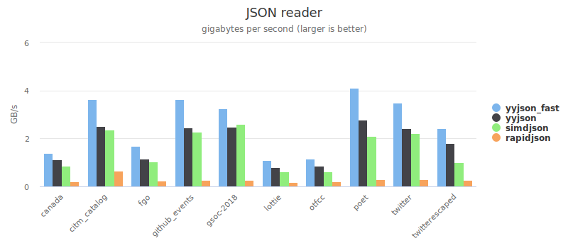

# 简介

[](https://github.com/ibireme/yyjson/actions/workflows/cmake.yml)
[](https://codecov.io/gh/ibireme/yyjson)
[](https://github.com/ibireme/yyjson/blob/master/LICENSE)
[](https://github.com/ibireme/yyjson/releases)
[](https://repology.org/project/yyjson/versions)

一个使用 ANSI C 开发的高性能 JSON 库。

# 特点
- **高速**：在现代 CPU 上每秒就能处理数 GB 的 JSON 数据。
- **可移植**：遵循 ANSI C (C89) 标准，确保跨平台兼容性。
- **严格**：遵循 [RFC 8259](https://datatracker.ietf.org/doc/html/rfc8259) JSON 标准，确保严格的数字格式和 UTF-8 验证。
- **可扩展**：提供选项以启用特定的 [JSON5](https://json5.org) 特性，并支持自定义内存分配器。
- **高精度**：能精确读写 `int64`、`uint64` 和 `double` 数字。
- **灵活**：支持无限的JSON嵌套层级、`\u0000` 字符以及非空字符结尾的字符串。
- **操作方便**：支持通过 [JSON Pointer](https://datatracker.ietf.org/doc/html/rfc6901)、[JSON Patch](https://datatracker.ietf.org/doc/html/rfc6902) 和 [JSON Merge Patch](https://datatracker.ietf.org/doc/html/rfc7386) 进行查询和修改。
- **对开发者友好**：仅需一个 `.h` 和一个 `.c` 文件即可轻松集成。

# 限制
- 数组或对象以诸如链表的[数据结构](https://ibireme.github.io/yyjson/doc/doxygen/html/data-structures.html)存储，这使得通过索引或键访问元素的速度比使用迭代器慢。
- 对象中允许存在重复的键，并且键的顺序会被保留。
- JSON 解析结果是不可变的，若需修改则需要创建 `可变副本`。

# 性能表现
基准测试项目和数据集：[yyjson_benchmark](https://github.com/ibireme/yyjson_benchmark)

如果大部分 JSON 字段在编译时已知，simdjson 新的 `On Demand` API 速度更快。
此基准测试项目仅测试 DOM API，后续将添加新的基准测试。

#### AWS EC2 (AMD EPYC 7R32, gcc 9.3)


|twitter.json|解析 (GB/s)|生成 (GB/s)|
|---|---|---|
|yyjson (原位解析)|1.80|1.51|
|yyjson|1.72|1.42|
|simdjson|1.52|0.61|
|sajson|1.16|   |
|rapidjson (原位解析)|0.77|   |
|rapidjson (utf8)|0.26|0.39|
|cjson|0.32|0.17|
|jansson|0.05|0.11|


#### iPhone (Apple A14, clang 12)


|twitter.json|解析 (GB/s)|生成 (GB/s)|
|---|---|---|
|yyjson (原位解析)|3.51|2.41|
|yyjson|2.39|2.01|
|simdjson|2.19|0.80|
|sajson|1.74||
|rapidjson (原位解析)|0.75| |
|rapidjson (utf8)|0.30|0.58|
|cjson|0.48|0.33|
|jansson|0.09|0.24|

更多包含交互式图表的基准测试报告 (更新于 2020-12-12)

|平台|CPU|编译器|操作系统|报告|
|---|---|---|---|---|
|Intel NUC 8i5|Core i5-8259U|msvc 2019|Windows 10 2004|[图表](https://ibireme.github.io/yyjson_benchmark/reports/Intel_NUC_8i5_msvc_2019.html)|
|Intel NUC 8i5|Core i5-8259U|clang 10.0|Ubuntu 20.04|[图表](https://ibireme.github.io/yyjson_benchmark/reports/Intel_NUC_8i5_clang_10.html)|
|Intel NUC 8i5|Core i5-8259U|gcc 9.3|Ubuntu 20.04|[图表](https://ibireme.github.io/yyjson_benchmark/reports/Intel_NUC_8i5_gcc_9.html)|
|AWS EC2 c5a.large|AMD EPYC 7R32|gcc 9.3|Ubuntu 20.04|[图表](https://ibireme.github.io/yyjson_benchmark/reports/EC2_c5a.large_gcc_9.html)|
|AWS EC2 t4g.medium|Graviton2 (ARM64)|gcc 9.3|Ubuntu 20.04|[图表](https://ibireme.github.io/yyjson_benchmark/reports/EC2_t4g.medium_gcc_9.html)|
|Apple iPhone 12 Pro|A14 (ARM64)|clang 12.0|iOS 14|[图表](https://ibireme.github.io/yyjson_benchmark/reports/Apple_A14_clang_12.html)|

### 为获得更佳性能，yyjson更倾向于：
* 具备以下特性的现代处理器：
    * 高指令级并行度
    * 优秀的分支预测器
    * 低非对齐内存访问开销
* 优化能力出色的现代编译器（如 clang）


# 示例代码

### 读取 JSON 字符串
```c
const char *json = "{\"name\":\"Mash\",\"star\":4,\"hits\":[2,2,1,3]}";

// 读取 JSON 并获取根节点
yyjson_doc *doc = yyjson_read(json, strlen(json), 0);
yyjson_val *root = yyjson_doc_get_root(doc);

// 获取根节点["name"]
yyjson_val *name = yyjson_obj_get(root, "name");
printf("姓名: %s\n", yyjson_get_str(name));
printf("姓名长度: %d\n", (int)yyjson_get_len(name));

// 获取根节点["star"]
yyjson_val *star = yyjson_obj_get(root, "star");
printf("星级: %d\n", (int)yyjson_get_int(star));

// 获取根节点["hits"]，遍历数组
yyjson_val *hits = yyjson_obj_get(root, "hits");
size_t idx, max;
yyjson_val *hit;
yyjson_arr_foreach(hits, idx, max, hit) {
    printf("点击量 %zu: %d\n", idx, (int)yyjson_get_int(hit));
}

// 释放文档
yyjson_doc_free(doc);

// 所有函数都接受 NULL 输入，并在出错时返回 NULL。
```

### 写入 JSON 字符串
```c
// 创建一个可变文档
yyjson_mut_doc *doc = yyjson_mut_doc_new(NULL);
yyjson_mut_val *root = yyjson_mut_obj(doc);
yyjson_mut_doc_set_root(doc, root);

// 设置根节点["name"] 和根节点["star"]
yyjson_mut_obj_add_str(doc, root, "name", "Yumo");
yyjson_mut_obj_add_int(doc, root, "star", 4);

// 使用数组设置根节点["hits"]
int hits_arr[] = {2, 2, 1, 3};
yyjson_mut_val *hits = yyjson_mut_arr_with_sint32(doc, hits_arr, 4);
yyjson_mut_obj_add_val(doc, root, "hits", hits);

// 转为字符串，最小化格式
const char *json = yyjson_mut_write(doc, 0, NULL);
if (json) {
    printf("生成的JSON: %s\n", json); // {"name":"Yumo","star":4,"hits":[2,2,1,3]}
    free((void *)json);
}

// 释放文档
yyjson_mut_doc_free(doc);
```

### 带选项读取 JSON 文件
```c
// 读取 JSON 文件，允许注释和末尾逗号
yyjson_read_flag flg = YYJSON_READ_ALLOW_COMMENTS | YYJSON_READ_ALLOW_TRAILING_COMMAS;
yyjson_read_err err;
yyjson_doc *doc = yyjson_read_file("/tmp/config.json", flg, NULL, &err);

// 遍历根对象
if (doc) {
    yyjson_val *obj = yyjson_doc_get_root(doc);
    yyjson_obj_iter iter;
    yyjson_obj_iter_init(obj, &iter);
    yyjson_val *key, *val;
    while ((key = yyjson_obj_iter_next(&iter))) {
        val = yyjson_obj_iter_get_val(key);
        printf("%s: %s\n", yyjson_get_str(key), yyjson_get_type_desc(val));
    }
} else {
    printf("读取错误(%u): %s，错误位置: %ld\n", err.code, err.msg, err.pos);
}

// 释放文档
yyjson_doc_free(doc);
```

### 带选项写入 JSON 文件
```c
// 将 JSON 文件作为可变文档读取
yyjson_doc *idoc = yyjson_read_file("/tmp/config.json", 0, NULL, NULL);
yyjson_mut_doc *doc = yyjson_doc_mut_copy(idoc, NULL);
yyjson_mut_val *obj = yyjson_mut_doc_get_root(doc);

// 移除根对象中的空值
yyjson_mut_obj_iter iter;
yyjson_mut_obj_iter_init(obj, &iter);
yyjson_mut_val *key, *val;
while ((key = yyjson_mut_obj_iter_next(&iter))) {
    val = yyjson_mut_obj_iter_get_val(key);
    if (yyjson_mut_is_null(val)) {
        yyjson_mut_obj_iter_remove(&iter);
    }
}

// 以美化格式写入 json，并转义 Unicode
yyjson_write_flag flg = YYJSON_WRITE_PRETTY | YYJSON_WRITE_ESCAPE_UNICODE;
yyjson_write_err err;
yyjson_mut_write_file("/tmp/config.json", doc, flg, NULL, &err);
if (err.code) {
    printf("写入错误(%u): %s\n", err.code, err.msg);
}

// 释放文档
yyjson_doc_free(idoc);
yyjson_mut_doc_free(doc);
```

# 文档
<!--（todo：有关中文内容）-->
最新的（未发布）文档可以在 [doc](https://github.com/ibireme/yyjson/tree/master/doc) 目录中访问。
已发布版本的预生成 Doxygen HTML 可在此处查看：
* [主页](https://ibireme.github.io/yyjson/doc/doxygen/html/)
    * [构建与测试](https://ibireme.github.io/yyjson/doc/doxygen/html/building-and-testing.html)
    * [API 和示例代码](https://ibireme.github.io/yyjson/doc/doxygen/html/api.html)
    * [数据结构](https://ibireme.github.io/yyjson/doc/doxygen/html/data-structures.html)
    * [更新日志](https://ibireme.github.io/yyjson/doc/doxygen/html/md__c_h_a_n_g_e_l_o_g.html)

# 打包状态

[](https://repology.org/project/yyjson/versions)

# 基于 yyjson 构建的项目

以下是一个非详尽的列表，包含那些将 yyjson 暴露给其他语言或在内部将其用于主要功能特性的项目。如果您有使用 yyjson 的项目，欢迎提交 PR 将其添加到此列表。

| 项目            | 语言        | 描述                                                                                          |
|-----------------|-------------|-------------------------------------------------------------------------------------------------------|
| [py_yyjson][]   | Python      | yyjson 的 Python 绑定                                                                           |
| [orjson][]      | Python      | Python 的 JSON 库，可选使用 yyjson 后端                                              |
| [serin][]       | C++ / Python | 支持 TOON、JSON 和 YAML 的 C++ 和 Python 序列化库，支持跨格式转换。 |
| [cpp-yyjson][]  | C++         | 使用 yyjson 后端的 C++ JSON 库                                                               |
| [reflect-cpp][] | C++         | 通过从结构体自动获取字段名实现序列化的 C++ 库                    |
| [xyjson][]      | C++         | yyjson 的 C++ 代理和封装，提供便捷的操作符重载                                |
| [yyjsonr][]     | R           | yyjson 的 R 语言绑定                                                                                 |
| [Ananda][]      | Swift       | 基于 yyjson 的 JSON 模型解码库                                                                  |
| [ReerJSON][]    | Swift       | 基于 yyjson 的更快版本的 JSONDecoder                                                      |
| [swift-yyjson][]| Swift       | 由 yyjson 驱动的 Swift 快速 JSON 库                                                     |
| [duckdb][]      | C++         | DuckDB 是一个进程内 SQL OLAP 数据库管理系统                                          |
| [fastfetch][]   | C           | 一个类似于 neofetch 的工具，用于获取系统信息并以美观的方式展示             |
| [Zrythm][]      | C           | 数字音频工作站，使用 yyjson 来序列化 JSON 项目文件                           |
| [bemorehuman][] | C           | 推荐引擎，专注于接收推荐的个人的独特性                     |
| [mruby-yyjson][]| mruby       | 基于 yyjson 的 mruby 高效 JSON 解析和序列化库                              |
| [YYJSON.jl][]   | Julia       | yyjson 的 Julia 语言绑定                                                                            |

# v1.0 版本待办事项
* [x] 添加文档页面。
* [x] 为持续集成和代码覆盖率添加 GitHub workflow。
* [x] 添加更多测试：valgrind, sanitizer, fuzzing。
* [x] 支持使用 JSON Pointer 查询和修改 JSON。
* [x] 为 JSON 读写器添加 `RAW` 类型。
* [x] 添加限制实数输出精度的选项。
* [x] 添加支持 JSON5 的选项。
* [ ] 添加比较两个 JSON 文档差异的函数。
* [ ] 添加关于性能优化的文档。
* [ ] 确保 ABI 稳定性。

# 许可证
本项目基于 MIT 许可证发布。

[py_yyjson]: https://github.com/tktech/py_yyjson
[orjson]: https://github.com/ijl/orjson
[serin]: https://github.com/mohammadraziei/serin
[cpp-yyjson]: https://github.com/yosh-matsuda/cpp-yyjson
[reflect-cpp]: https://github.com/getml/reflect-cpp
[xyjson]: https://github.com/lymslive/xyjson
[yyjsonr]: https://github.com/coolbutuseless/yyjsonr
[Ananda]: https://github.com/nixzhu/Ananda
[ReerJSON]: https://github.com/reers/ReerJSON
[swift-yyjson]: https://github.com/mattt/swift-yyjson
[duckdb]: https://github.com/duckdb/duckdb
[fastfetch]: https://github.com/fastfetch-cli/fastfetch
[Zrythm]: https://github.com/zrythm/zrythm
[bemorehuman]: https://github.com/BeMoreHumanOrg/bemorehuman
[mruby-yyjson]: https://github.com/buty4649/mruby-yyjson
[YYJSON.jl]: https://github.com/bhftbootcamp/YYJSON.jl