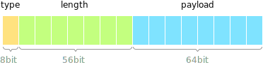
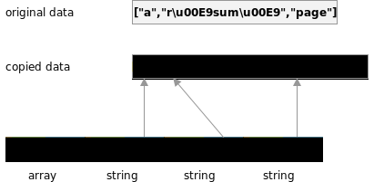
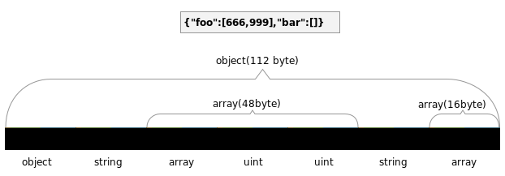
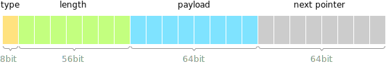

数据结构
===============

@note 翻译最后更新时间：2026/2/27 13:01<br>翻译质量反馈：[yyjson文档中文翻译](https://xiaoditx.github.io/moments/2026-3/07-2115/)

yyjson 由两种数据结构构成：可变数据和不可变数据。

|                 | 不可变        | 可变             |
|-----------------|---------------|------------------|
| 文档（Document） | yyjson_doc    | yyjson_mut_doc   |
| 值（Value）      | yyjson_val    | yyjson_mut_val   |

- 读取 JSON 文档时返回的是不可变数据结构。它们不能被修改。
- 构建 JSON 文档时会创建可变数据结构。它们可以被修改。
- yyjson 还提供了一些函数，用于在这两种数据结构之间进行转换。

请注意，本文档中描述的数据结构被视为私有结构，建议使用公共 API 来访问它们。

---------------
## 不可变值
每个 JSON 值都存储在一个不可变的 `yyjson_val` 结构体中：
```c
struct yyjson_val {
    uint64_t tag;
    union {
        uint64_t    u64;
        int64_t     i64;
        double      f64;
        const char *str;
        void       *ptr;
        size_t      ofs;
    } uni;
}
```


值的类型存储在 `tag` 的低 8 位中。<br/>
值的大小（例如字符串长度、对象大小或数组大小）存储在 `tag` 的高 56 位中。

现代 64 位处理器通常对 RAM 地址的支持位数少于 64 位（[维基百科](https://en.wikipedia.org/wiki/RAM_limit)）。例如，Intel64、AMD64 和 ARMv8 的物理地址限制为 52 位（4PB）。因此，将类型和大小信息存储在 64 位的 `tag` 中是安全的。

## 不可变文档
一个 JSON 文档将所有字符串存储在一个**连续**的内存区域中。<br/>
每个字符串都会被原地反转义，并以空字符结尾。<br/>
例如：




一个 JSON 文档将所有值存储在另一个**连续**的内存区域中。<br/>
`object`（对象）和 `array`（数组）容器会记录它们自身使用的内存大小，从而可以轻松遍历其子值。<br/>
例如：



---------------
## 可变值
每个可变的 JSON 值都存储在一个 `yyjson_mut_val` 结构体中：
```c
struct yyjson_mut_val {
    uint64_t tag;
    union {
        uint64_t    u64;
        int64_t     i64;
        double      f64;
        const char *str;
        void       *ptr;
        size_t      ofs;
    } uni;
    yyjson_mut_val *next;
}
```


`tag` 和 `uni` 字段与不可变值中的相同，而 `next` 字段用于构建链表。


## 可变文档
一个可变的 JSON 文档由多个 `yyjson_mut_val` 组成。

`object`（对象）或 `array`（数组）的子值被链接成一个循环链表，<br/>
其父节点持有这个循环链表的**尾部（tail）**，这使得 yyjson 能够以常数时间执行 `append`（追加）、`prepend`（前置）和 `remove_first`（移除首个）等操作。

例如：


---------------
## 内存分配器

一个 JSON 文档（`yyjson_doc`, `yyjson_mut_doc`）负责管理其所有 JSON 值和字符串的内存。当不再需要某个文档时，用户必须调用 `yyjson_doc_free()` 或 `yyjson_mut_doc_free()` 来释放与其关联的内存。

一个 JSON 值（`yyjson_val`, `yyjson_mut_val`）的生命周期与其所属的文档相同。其内存由其文档管理，并且不能独立释放。

更多信息，请参考 API 文档。
